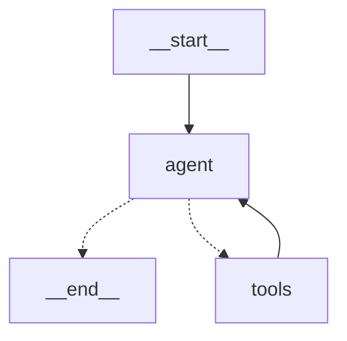

# AI Agent 学习笔记

> **快速上下文**：如需快速了解项目进度和技术栈，请先看 `agent-context.md`  
> **本文件用途**：详细记录学习过程、思考和踩坑经验

## Day 1 (2026-01-31)

### 目标

快速验证一个最简 LangGraph 对话 demo，建立"代理 = LLM + 状态 + 图结构"的直观感受

### 环境搭建

- Miniconda + Python 3.12.3 (ARM64)
- 创建独立环境 py312 并设为默认激活

```bash
# 1. 创建环境
conda create -n py312 python=3.12 -y

# 2. 禁止 base 自动激活
conda config --set auto_activate_base false

# 3. 写入 .zprofile 自动激活 py312
echo -e "\n# Conda default environment\nconda activate py312" >> ~/.zprofile
source ~/.zprofile

# 4. 验证
python --version

# 5.安装依赖
python -m pip install -U langgraph langchain langchain-core langchain-openai langchain-community python-dotenv httpx
```

- 环境优化：切换到 `libmamba` 求解器，将默认 Python 改为 3.12，引入`conda-forge`

```shell
conda update -n base conda -y
conda install -n base conda-libmamba-solver -y
conda config --set solver libmamba
conda config --add channels conda-forge
conda config --set channel_priority strict
```

- LLM 选择：qwen-flash,理由，速度快，免费

### 代码实现

- 文件：`hello_agent.py`
- 关键代码片段：

```python
#构建prompt
def create_prompt() -> ChatPromptTemplate:
    return ChatPromptTemplate.from_messages([
        ("system", SYSTEM_PROMPT),
        MessagesPlaceholder("messages"),
    ])

#构建带prompt的llm实体
llm = ChatOpenAI(
    base_url=config.base_url,
    api_key=config.api_key,
    model=config.model,
    temperature=config.temperature,
)
prompt = create_prompt()
llm_chain = prompt | llm

#构建代理节点
def agent(state: MessagesState) -> dict:
    """核心代理节点"""
    try:
        response = llm_chain.invoke(state["messages"])
        logger.debug(f"生成回复，长度：{len(response.content)}")
        return {"messages": [response]}
    except Exception as e:
        logger.error(f"代理执行失败: {str(e)}")
        error_msg = AIMessage(content=f"抱歉，发生内部错误：{str(e)}\n请稍后再试。")
        return {"messages": [error_msg]}

#构建图      
def build_graph():
    workflow = StateGraph(state_schema=MessagesState)
    workflow.add_node("agent", agent)
    workflow.add_edge(START, "agent")
    workflow.add_edge("agent", END)
    return workflow.compile()
graph = build_graph()

# 循环调用代理，并加入上下文
result = graph.invoke({"messages": messages_history})
ai_msg = result["messages"][-1]
messages_history.append(ai_msg)
```

### 运行输出

```bash
❯ python hello_agent_v1.py
2026-01-31 16:42:03 | INFO  | 加载模型配置：openrouter / deepseek/deepseek-chat (temp=0.4)
2026-01-31 16:42:03 | INFO  | LangGraph 已编译完成

══════════════════════════════════════════════════════════════════════
🤖 AI 代理对话模式 已启动
  模型：deepseek/deepseek-chat
  温度：0.4
  最大历史：20 条
  命令：/help 查看帮助   exit / quit / q 退出
══════════════════════════════════════════════════════════════════════

你: 你好啊
2026-01-31 16:42:19 | INFO  | HTTP Request: POST https://openrouter.ai/api/v1/chat/completions "HTTP/1.1 200 OK"
AI : <thinking>
1. 理解用户意图：用户在进行简单的问候
2. 需要的信息/工具：无需额外信息
3. 我的推理步骤：作为AI助手，应该礼貌回应问候
</thinking>

<final_answer>
您好！我是AI助手，很高兴为您服务。请问有什么可以帮您的吗？
</final_answer>

你: 
```

### 问题 & 解决

- **ModuleNotFoundError: No module named 'langgraph'**
  - 原因：pip 装到了错的环境
  - 解决：`conda activate py312 + python -m pip install ...`
- **多轮对话失忆**
  - 原因：每次invoke只传当前消息
  - 解决：外部维护`messages_history`列表，完整传入

### 关键概念总结

1. **ChatPromptTemplate + MessagesPlaceholder**

   用来构建带历史消息的结构化提示模板，是控制输出格式的关键

2. **ChatOpenAI + LCEL 链式调用（prompt | llm）**

   LangChain 的现代写法，简洁且可组合。

3. **MessagesState**

   LangGraph 内置的状态类型，自动处理 messages 追加，比自定义 TypedDict 更简洁。

4. **agent 节点**

   代理的核心逻辑：接收 state → 调用 LLM → 返回更新后的 state。

5. **StateGraph & compile**

   定义图结构（节点 + 边），compile 后得到可调用的 graph 对象。

6. **上下文记忆的真相**

   LangGraph invoke是无状态的，必须自己每次传入完整消息历史。

### 心得 & 最大收获

- 第一次感受到"写 AI 代理"和"写普通函数"很像（节点 = 函数，状态 = 参数）
- 明白了为什么很多人说 LangGraph 比老 LangChain AgentExecutor 更灵活（但也更需要手动管理状态）
- 环境配置虽然花了时间，但一旦通了，后续开发效率很高
- 最大的惊喜：跑通多轮对话后，真的有"它在和我聊天"的感觉

## Day 2 (2026-02-01/02)

### 今日目标

让代理具备工具调用能力，实现最基础的 ReAct 循环（Reason → Act → Observe → Reason → Final Answer）

### 核心实现

1. **工具定义**

```python
@tool
def calculate(expression: str) -> str:
    """执行数学计算。注意：sin/cos/tan 默认使用弧度。如需角度计算，请使用 pi 配合。"""
    try:
        allowed_names = {"__builtins__": {}}
        allowed_names.update({
            "sin": __import__("math").sin,
            "cos": __import__("math").cos,
            "tan": __import__("math").tan,
            "sqrt": __import__("math").sqrt,
            "pi": __import__("math").pi,
        })
        result = eval(expression, allowed_names)
        return str(result)
    except Exception as e:
        return f"计算错误：{str(e)}"
```

1. **工具绑定与链（关键顺序）**

```python
tools = [calculate]
llm_with_tools = llm.bind_tools(tools)           # 先绑定工具
prompt = create_prompt()
llm_chain = prompt | llm_with_tools              # 再接提示词
```

1. **系统提示词（关键部分）**

```
你是一个具备计算能力的 AI 助手。
当用户要求进行数学运算时，请调用 calculate 工具。
计算完成后，请根据工具返回的结果给用户最终答案。
全程用中文回复。
```

1. **ReAct 图结构**

```python
def build_graph_with_tool():
    workflow = StateGraph(state_schema=MessagesState)
    tool_node = ToolNode(tools=tools)
    workflow.add_node("agent", agent)
    workflow.add_node("tools", tool_node)
    workflow.add_edge(START, "agent")
    workflow.add_conditional_edges(
        "agent",
        tools_condition,
        {"tools": "tools", END: END}
    )
    workflow.add_edge("tools", "agent")
    return workflow.compile()
```

1. **可视化（Mermaid 图）**



1. **交互循环关键逻辑（摘录）**

```python
messages_history.append(user_msg)
if len(messages_history) > config.max_history:
    messages_history = messages_history[-config.max_history:]
result = graph.invoke({"messages": messages_history})
ai_msg = result["messages"][-1]
messages_history.append(ai_msg)
```

### 测试记录（真实输出）

1. 输入：你好
   输出：正常问候回复（无工具调用）

2. 输入：8 * 9 是多少？
   输出：8 × 9 等于 72

3. 输入：sin(pi/2) 等于多少？
   输出：sin(π/2) 等于 1.0

4. 输入：刚才的计算结果是多少？
   输出：刚才的计算结果是：sin(π/2) = 1.0。

5. 输入：(3 + 5) * 2 是多少？
   输出：(3 + 5) × 2 等于 16

### 关键收获（5 条）

1. 工具绑定必须先 llm.bind_tools，再 prompt | llm_with_tools（顺序反了会报错）
2. tools_condition 自动判断 AIMessage 是否有 tool_calls，决定是否进入 tools 节点
3. ToolNode 会自动执行工具并把结果包装成 ToolMessage 回传给 agent
4. prompt 必须明确写明工具使用规则、调用格式，否则模型可能不触发工具
5. qwen-flash 模型工具调用能力较强，适合当前实验（比 deepseek-chat 更稳定）

### 心得 & 感受

- 今天最爽的时刻：更换更快更准确调用参数的模型后，准确率大幅上升；画出 Mermaid 图后，能够更深刻理解 ReAct 循环的流转路径
- 最大的困惑：无（今天整体很顺）
- 对代理的新理解：代理本质就是一个大模型节点，输入输出其实是自定义的，目前还是单输入单输出，记忆其实是代码实现的（messages_history 列表），后续可能会有更好的实现方式，或者封装好的函数（如 checkpointer）

### 下一步计划（Day 3+）

- 加更多工具（当前时间、天气查询、网页搜索）
- 尝试更强模型（qwen2.5-72b-instruct）
- 引入 checkpointer / MemorySaver，实现会话持久化与断点续传
- 测试复杂多步计算（例如需要多次调用工具的题目）
- （可选）用 LangGraph Studio 可视化调试

## Day 3 (2026-02-03)

### 今日目标

实现会话持久化（checkpointer） + 增加实用工具（时间 + 天气）

### 核心实现

1. **持久化机制（MemorySaver）**
   - 关键代码：

     ```python
     from langgraph.checkpoint.memory import MemorySaver
     memory = MemorySaver()
     graph = build_graph_with_tool().compile(checkpointer=memory)
     ```

   - 交互时固定 thread_id：

     ```python
     checkpoint_config = {"configurable": {"thread_id": "my_test_session_1"}}
     result = graph.invoke({"messages": [HumanMessage(content=user_input)]}, config=checkpoint_config)
     ```

   - 特点：内存型，重启程序后丢失；适合开发调试

2. **新增工具**
   - **get_current_time**（无外部依赖）

     ```python
     @tool
     def get_current_time(format_str: str = "%Y-%m-%d %H:%M:%S") -> str:
         """获取当前时间，格式化输出"""
         return datetime.now().strftime(format_str)
     ```

   - **get_weather**（免费 open-meteo API）

     ```python
     @tool
     def get_weather(city: str = "成都") -> str:
         """获取指定城市天气，默认成都"""
         try:
             city_coords = {
                 "成都": {"lat": 30.57, "lon": 104.06},
                 # 其他城市...
             }
             coords = city_coords.get(city, city_coords["成都"])
             url = f"https://api.open-meteo.com/v1/forecast?latitude={coords['lat']}&longitude={coords['lon']}&current=temperature_2m,weathercode&timezone=Asia/Shanghai"
             resp = requests.get(url, timeout=5).json()
             temp = resp["current"]["temperature_2m"]
             weather_code = resp["current"]["weathercode"]
             weather_map = {0: "晴朗", 1: "多云", ...}
             weather_desc = weather_map.get(weather_code, "未知天气")
             return f"{city}当前天气：{weather_desc}，温度约 {temp}℃"
         except Exception as e:
             return f"天气查询失败：{str(e)}"
     ```

3. **工具集合 & 绑定**

   ```python
   tools = [calculate, get_current_time, get_weather]
   llm_with_tools = llm.bind_tools(tools)
   llm_chain = prompt | llm_with_tools
   ```

4. **交互循环关键变化**
   - 不再手动维护 messages_history
   - 每次只传当前新消息，checkpointer 自动加载历史
   - 支持 /clear 命令删除 checkpoint

5. **Mermaid 图（当前结构）**

   ```mermaid
   graph TD
       __start__ --> agent
       agent -.-> __end__
       agent -.-> tools
       tools --> agent
   ```

### 测试记录

1. 输入：你好  
   输出：正常问候回复（无工具调用）

2. 输入：现在几点了？  
   输出：调用 get_current_time，返回当前时间

3. 输入：成都天气怎么样？  
   输出：调用 get_weather，返回成都温度 + 天气描述

4. 输入：刚才的时间是几点？  
   输出：能记住上一次时间（持久化生效）

5. 重启程序后问：刚才我说过什么？  
   输出：不记得（MemorySaver 是内存型，重启进程丢失）

### 关键收获

1. MemorySaver 实现"同一个进程内"持久化，但重启程序后丢失
2. checkpointer 的核心是 thread_id：同一个 id = 同一个会话
3. invoke 时只传新消息 + config，checkpointer 自动加载历史
4. 工具调用成功率高时，prompt 必须写清楚"什么时候用哪个工具"
5. qwen-flash 在工具调用 + 中文回复上表现稳定

### 心得

最爽的时刻：第一次看到代理自动调用时间和天气工具，并且能记住上文  
最大的困惑：一开始以为 MemorySaver 能跨程序持久化，后来才明白它是内存型  
对代理的新理解：代理的"记忆"其实是外部状态管理（checkpointer），模型本身无状态；持久化是 agent 系统工程化的第一步

### 下一步计划

- 换成 SqliteSaver，实现"重启程序甚至重启电脑还能接着聊"
- 加网页搜索工具（requests + beautifulsoup 或 serpapi）
- 测试多步任务（例如"先查天气，再算温度*2"）
- 用 LangGraph Studio 打开当前图，实时调试
- 尝试更强模型（qwen2.5-72b-instruct）对比工具调用稳定性

## Day 4 (2026-02-05)

### 今日目标

实现真正的持久化存储（SqliteSaver）+ 项目结构优化

### 核心实现

1. **SQLite 持久化机制**
   - 数据库文件路径管理：

     ```python
     # 将 SQLite 文件放到独立目录（如 ./data/checkpoints/checkpoints.db）
     db_dir = Path(__file__).parent / "data" / "checkpoints"
     db_dir.mkdir(parents=True, exist_ok=True)
     db_path = db_dir / "checkpoints.db"
     ```

   - SQLite 上下文管理器使用：

     ```python
     with SqliteSaver.from_conn_string(str(db_path)) as memory:
         compile_graph = graph.compile(checkpointer=memory)
         # 聊天循环...
     ```

   - 关键改进：数据库文件放到 `./data/checkpoints/checkpoints.db`，保持根目录整洁

2. **会话清空功能**
   - 支持 `/clear` 或 `/reset` 命令：

     ```python
     if cmd in ['/clear', '/reset']:
         thread_id = checkpoint_config["configurable"]["thread_id"]
         memory.delete_thread(thread_id)
         print(f"🧹 当前会话历史已清空，thread_id: {thread_id}")
         continue
     ```

3. **项目结构优化**
   - 保持现有的工具集合不变：

     ```python
     tools = [calculate, get_current_time, get_weather]
     llm_with_tools = llm.bind_tools(tools)
     llm_chain = prompt | llm_with_tools
     ```

   - 图构建逻辑保持一致：

     ```python
     def build_graph_with_tool() -> StateGraph:
         """构建带有工具调用能力的 LangGraph 图"""
         workflow = StateGraph(state_schema=MessagesState)
         tool_node = ToolNode(tools=tools)
         workflow.add_node("agent", agent)
         workflow.add_node("tools", tool_node)
         workflow.add_edge(START, "agent")
         workflow.add_conditional_edges(
             "agent",
             tools_condition,
             {"tools": "tools", END: END}
         )
         workflow.add_edge("tools", "agent")
         return workflow
     ```

4. **启动信息优化**
   - 显示持久化支持状态：

     ```python
     print("🤖 AI 代理对话模式 已启动（支持持久化）")
     print(f"  模型：{config.model}")
     print(f"  温度：{config.temperature}")
     print("  命令：/help 查看帮助   exit / quit / q 退出")
     ```

5. **Mermaid 图（当前结构）**

   ```mermaid
   graph TD
       __start__ --> agent
       agent -.-> __end__
       agent -.-> tools
       tools --> agent
   ```

### 测试记录

1. 输入：你好  
   输出：正常问候回复（显示支持持久化）

2. 输入：现在几点了？  
   输出：调用 get_current_time，返回当前时间

3. 输入：成都天气怎么样？  
   输出：调用 get_weather，返回成都温度 + 天气描述

4. 输入：刚才的时间是几点？  
   输出：能记住上一次时间（持久化生效）

5. 输入：/clear  
   输出：?? 当前会话历史已清空，thread_id: my_test_session_1

6. 重启程序后问：刚才我说过什么？  
   输出：能记住重启前的对话内容（SQLite 持久化生效）

7. 检查数据库文件：./data/checkpoints/checkpoints.db  
   结果：数据库文件存在，数据完整保存

### 关键收获

1. SqliteSaver 实现真正的跨程序持久化，重启后数据不丢失
2. 数据库文件放到 data/checkpoints 目录是良好的工程实践
3. 使用上下文管理器确保 SQLite 连接正确关闭
4. `memory.delete_thread(thread_id)` 可以清空指定会话
5. 持久化存储让代理系统更加稳定可靠

### 心得

最爽的时刻：重启程序后代理还能记住之前的对话内容，真正的持久化实现了  
最大的困惑：SqliteSaver 的上下文管理器使用方式，最初踩了坑（TypeError: Invalid checkpointer）  
对代理的新理解：持久化是代理系统从实验走向实用的重要一步，让用户体验更连贯

### 下一步计划（已调整优先级）

**阶段 5：深入理解系统局限（优先）**
- 测试复杂多步任务（如"先查天气，再用温度计算"）
- 测试工具调用失败场景（如查询不支持的城市）
- 测试长对话性能（30+ 轮对话）
- 分析当前 ReAct 循环的局限性

**阶段 6：Human-in-the-loop（人在回路中）**
- 实现关键操作前的人工确认机制
- 学习 interrupt 和 Command API
- 设计需要人工介入的场景

**阶段 7：复杂图结构**
- 并行工具调用（同时查询多个城市天气）
- 条件分支路由（根据结果走不同路径）
- 自定义状态管理（超越 MessagesState）
- 子图（Subgraph）设计

**后续可选（产品功能，非核心）**
- 多会话管理、会话列表
- 网页搜索工具
- LangGraph Studio 可视化
- 用户认证和权限管理

## Day 5 (2026-02-12)

### 今日目标

深入测试当前 ReAct 系统的边界，通过 4 个关键场景揭示局限性

### 测试设计

创建了 `test_limits.py`，包含 4 个系统性测试：

1. **多步推理**：查天气 → 用温度计算（测试顺序任务能力）
2. **工具失败**：查询不支持的城市（测试错误处理）
3. **嵌套推理**：天气 → 计算 → 再计算（测试链式依赖）
4. **并发需求**：同时查询北京、上海、成都（测试并行能力）

### 测试结果

| 测试 | 结果 | 工具调用次数 | 关键发现 |
|------|------|-------------|----------|
| 多步推理 | ✅ 成功 | 2 次 | ReAct 循环支持顺序多步任务 |
| 工具失败 | ✅ 优雅 | 0 次 | 模型能预判工具能力，避免盲目调用 |
| 嵌套推理 | ✅ 成功 | 3 次 | MessagesState 能支撑 3 步链式推理 |
| 并发需求 | ⚠️ 部分支持 | 1 次（但实际发 3 个请求）| 模型能一次发多个 tool_calls，但执行可能顺序 |

### 关键收获

1. **多步推理能力确认**
   - 测试 1：成功完成「查天气（12.1℃）→ 计算（12.1 × 2 + 10 = 34.2）」
   - 测试 3：成功完成 3 步链式「天气 → T×2 → √(T×2)」
   - 说明：当前 ReAct 循环对「依赖关系明确的顺序任务」支持良好

2. **错误处理机制优雅**
   - 查询「纽约天气」时，模型直接拒绝（0 次工具调用）
   - 原因：模型从 `get_weather` 的 docstring 看到只支持中国 10 城
   - 启示：工具文档 (docstring) 质量直接影响调用准确率

3. **并发能力的真相**（重要发现）
   - 初始假设：当前系统「无法并发」
   - 实际情况：模型在一次 AIMessage 里发出了 **3 个 tool_calls**（北京、上海、成都）
   - ToolNode 在一轮里执行了这 3 个请求（统计显示「1 次工具节点调用」）
   - 问题：ToolNode 可能是**顺序执行**而非真正并行（未利用异步/多线程）

4. **日志揭示的细节**

   ```
   2026-02-12 11:04:00 | INFO  | 🔧 工具调用 | get_weather | 城市: 北京
   2026-02-12 11:04:00 | INFO  | 🔧 工具调用 | get_weather | 城市: 上海
   2026-02-12 11:04:00 | INFO  | 🔧 工具调用 | get_weather | 城市: 成都
   ```

   三个工具调用的时间戳相同（11:04:00），但返回时间不同（北京和成都在 01 秒，上海在 06 秒），说明很可能是顺序执行

### 两大核心局限

经过测试，当前 ReAct 系统的真正局限是：

#### 局限 1：隐式规划 = 模型黑盒决策

- **表现**：模型自己决定用哪个工具、何时用、用几次
- **优点**：灵活，适合简单任务
- **问题**：
  - 无法显式控制执行流程
  - 复杂任务可能跳步、重复或遗漏
  - 调试困难（不知道模型为什么选了某个工具）
- **对 Manus/OpenClaw 的意义**：
  - 高级 Agent 系统需要「任务分解 → 逐步执行 → 检查点确认」
  - 隐式规划不够可控，关键操作必须有人工审核
  - 解决方案：Phase 6（Human-in-the-loop）和更显式的 Planner

#### 局限 2：工具执行性能 = 顺序瓶颈

- **表现**：虽然模型能一次发多个 tool_calls，但 ToolNode 可能顺序执行
- **问题**：
  - 涉及多个慢速 API（搜索、数据库）时，总耗时 = 单次 × N
  - 「查三城天气」理论上可并行（耗时 = max(单次)），实际可能是串行
- **对 Manus/OpenClaw 的意义**：
  - 高级 Agent 的「多源信息查询 + 并行 API 调用」需要并发能力
  - 顺序执行会增加总耗时，影响响应速度
  - 解决方案：Phase 7（并行图结构 / 自定义异步工具节点）

### 心得 & 感受

- 最爽的时刻：看到模型一次发出 3 个 tool_calls，说明「批量请求」是可行的
- 最大的意外：以为「并发测试」会失败，但实际上只是「执行并发」的问题，不是「请求并发」
- 对代理的新理解：
  - ReAct 循环的核心不是「能不能发多个请求」，而是「能不能智能决策何时发请求」
  - 性能瓶颈往往在「工具执行层」，而非「图结构层」
  - 隐式规划适合探索，显式规划适合生产

## Day 6 (2026-02-12) —— Prompt 工程：描述性 vs 命令性

### 问题

将 System Prompt 和工具 docstring 都改为「默认查询成都天气」后，输入「今天天气怎么样」，Agent 仍然回复"您没有指定城市"。

### 根本原因

模型的**内置安全习惯**（"问清楚用户意图"）优先级 > Prompt 里的描述性语句。

```
用户："今天天气怎么样？"
模型内部判断：用户意图不够明确 → 询问用户
（Prompt 里的「默认成都」被忽略）
```

### 修复方式

| 位置 | 修改前（描述性）| 修改后（命令性）|
|------|---------------|----------------|
| System Prompt | `默认查询成都天气` | `未指定城市时直接用 city='成都'，不要询问用户` |
| 工具 docstring | `默认城市为成都` | `未指定城市时默认查询成都` |

**关键差别**：
- ❌ 描述性：告诉模型"有个默认值"（模型可以选择不用）
- ✅ 命令性：告诉模型"必须这么做 + 禁止反问"（模型必须执行）

### 核心规律

```
Prompt 控制优先级：
  模型内置习惯（安全/礼貌）
    > 命令句 + 禁止反问（"直接用...，不要询问"）
    > 描述句（"默认..."）
```

### 对 Phase 6 的启发

这也说明了为什么 Human-in-the-loop 要从**图结构层面**介入——仅靠 Prompt 无法可靠地控制模型行为，有时必须通过 `interrupt` 强制暂停，而不是依赖 Prompt 里的"请在执行前询问用户"。

---

### 项目重新定位（2026-02-12）

**新目标**：实现一个"教学版 OpenClaw"

**范围调整**：
- ✅ 必须做：电脑操作（bash/file）+ 显式规划 + 安全机制 + 持久记忆 + 单渠道
- ❌ 不做：10 渠道同时接入、Gateway WebSocket、原生 App、Docker 沙箱、MCP 协议
- 🎯 重点：理解核心架构原理，而非复刻完整产品

**调整后的学习路径**：
```
Phase 6  → Human-in-the-loop（安全闸门）
Phase 7  → 显式规划循环（Think→Plan→Act→Observe）
Phase 8  → 电脑操作工具（bash + file.read/write）
Phase 9  → 持久记忆优化（Markdown 跨会话存储）
Phase 10 → Telegram Bot 接入（可选）
```

**预计时间**：7-11 周（每周 10-15 小时）

---

### 下一步：Phase 6 — Human-in-the-loop

**第一个场景（待实现）**：
- 在调用 `calculate` 前插入 interrupt，让用户确认表达式是否正确
- 学习 LangGraph 的 `interrupt` / `Command` API
- 实现「暂停 → 人工确认/修改 → 恢复执行」的完整流程

**为什么这个优先级最高**：
- Phase 8 的电脑操作工具（bash/file）必须先有安全机制
- OpenClaw 有 DM 配对、权限控制、Docker 隔离，说明安全是基础设施
- 这是从「不可控 Agent」走向「可信 Agent」的第一步

---

## Day 7 (2026-02-12) —— 代码重构：模块化架构定型

### 背景

Phase 5 完成后，代码经历了两轮重构：

1. **GPT 第一轮重构**：从 `hello_agent_v3.py` 提取出模块（工具层、核心层、CLI 层）。结果：功能正确，但文件命名抽象（`agent_runtime.py`、`chat_runner.py`、`agent_toolkit.py`）不利于学习。
2. **第二轮简化命名**：按"教学优先"原则，回归直白命名，让文件名能直接说明它在做什么。

### 最终模块结构

```
agent_tools.py   →  工具定义（计算 / 时间 / 天气）
agent_core.py    →  LLM 配置 + 图构建
agent_cli.py     →  CLI 交互循环 + SqliteSaver
main.py          →  入口（3 行组装，10 行运行）
test_limits.py   →  5 个回归测试（PASS/FAIL 判定）
```

**依赖关系**：
```
agent_tools.py ← agent_core.py ← agent_cli.py
                                ← main.py
                                ← test_limits.py
```

### 关键代码模式

**main.py（最简组装）**：
```python
tools = get_default_tools()
config, graph = create_configured_graph(tools=tools)
run_interactive_chat(graph=graph, config=config)
```

**create_configured_graph（一键建图）**：
```python
def create_configured_graph(tools, system_prompt=DEFAULT_SYSTEM_PROMPT):
    config = create_default_config()   # 加载 .env → 创建 LLMConfig
    graph  = build_agent_graph(config, tools, system_prompt)
    return config, graph
```

**test_limits.py（回归测试）**：新增了第 5 个测试——「默认城市策略」，验证 Prompt 工程修复后的行为。

### 重构经验：命名原则

| 反面示例 | 正面示例 | 理由 |
|---------|---------|------|
| `agent_runtime.py` | `agent_core.py` | runtime 过于抽象，core 直指"核心" |
| `chat_runner.py` | `agent_cli.py` | runner 不直观，cli 直接说明用途 |
| `agent_toolkit.py` | `agent_tools.py` | toolkit 多余，tools 简洁 |
| `run_agent.py` | `main.py` | 约定俗成的 Python 入口命名 |

**结论**：教学项目的命名优先选「读到名字就知道它做什么」，而不是「显得专业」。

### 测试场景更新

`test_limits.py` 目前包含 **5 个测试场景**：

| # | 场景 | 断言 |
|---|------|------|
| 1 | 多步推理：查天气 → 计算 | min_tool_calls=2, 含"成都" |
| 2 | 工具失败：查询纽约 | 工具输出含"暂不支持", "纽约" |
| 3 | 嵌套推理：天气 → 计算 → 再算 | min_tool_calls=2, 含"成都" |
| 4 | 并发需求：查三城 | min_tool_calls=1, 含"北京上海成都" |
| 5 | 默认城市策略：未指定城市 | min_tool_calls=1, 含"成都" |

### 关键收获

1. **模块化的价值**：main.py 只有 3 行业务逻辑，说明关注点分离做到位了
2. **命名即文档**：好的文件名让新人 5 分钟看懂架构，坏的命名让老人都要看代码才理解
3. **测试即规范**：回归测试把「期望行为」写成了代码，是最活的文档
4. **图没变，架构变了**：LangGraph 的节点图结构从未改变，变的是围绕它的工程组织方式

---

## Day 8 (2026-03-08) —— Phase 6: Human-in-the-loop

### 今日目标

在 `calculate` 工具执行前插入人工确认点，其他工具（查时间、查天气）自动执行。
实现「暂停 → 显示表达式 → 用户确认/取消 → 恢复/放弃」的完整流程。

### 核心实现

1. **为什么不能直接用 `interrupt_before=["tools"]`**

   `interrupt_before` 只能指定节点名，一个 `tools` 节点装了所有工具，interrupt 就会对所有工具生效。必须把 `calculate` 拆成独立节点，才能精确控制。

2. **节点拆分（agent_core.py）**

   ```python
   TOOLS_REQUIRING_CONFIRMATION = {"calculate"}

   confirm_tools = [t for t in tool_list if t.name in TOOLS_REQUIRING_CONFIRMATION]
   auto_tools    = [t for t in tool_list if t.name not in TOOLS_REQUIRING_CONFIRMATION]

   workflow.add_node("calculate", ToolNode(tools=confirm_tools))
   workflow.add_node("tools",     ToolNode(tools=auto_tools))
   ```

3. **自定义路由函数（替代 tools_condition）**

   ```python
   def _route_tools(state: MessagesState):
       last = state["messages"][-1]
       if not getattr(last, "tool_calls", None):
           return END
       tool_name = last.tool_calls[0]["name"]
       return "calculate" if tool_name in TOOLS_REQUIRING_CONFIRMATION else "tools"
   ```

   新图结构：
   ```
   START → agent → [_route_tools] → calculate → agent → END
                                  ↘ tools    → agent
                                  ↘ END
   ```

4. **interrupt + 确认循环（agent_cli.py）**

   ```python
   compiled_graph = graph.compile(checkpointer=memory, interrupt_before=["calculate"])

   result = compiled_graph.invoke(inputs, config=checkpoint_config)
   last_msg = result["messages"][-1]
   if last_msg.tool_calls:
       # calculate 节点前被 interrupt，工具尚未开始执行
       tool_call = last_msg.tool_calls[0]
       print(f"⏸️  即将执行工具：{tool_call['name']}")
       print(f"   参数：{tool_call['args']}")
       comfirm = input("是否继续执行工具？(y/n): ").strip().lower()
       if comfirm == "y":
           result = compiled_graph.invoke(None, config=checkpoint_config)  # 恢复
           last_msg = result["messages"][-1]
           print(f"AI : {last_msg.content}\n")
       else:
           print("❌ 已取消工具调用。输入 /clear 可重置会话。\n")
           continue
   else:
       print(f"AI : {last_msg.content}\n")
   ```

   `invoke(None, ...)` 里的 `None`：表示不追加任何新消息，直接从 checkpoint 恢复执行。

### 测试记录

1. 输入：3 加 5 等于多少
   输出：弹出确认提示，参数 `{'expression': '3 + 5'}`，确认后返回 8

2. 输入：现在几点了
   输出：直接调用 get_current_time，无确认弹窗（走 tools 节点）

3. 输入：上海天气加 10 再减 8
   预期：先自动查天气（tools 节点），再弹出 calculate 确认
   实际：**测不过**。模型拿到天气数值后直接内联计算，不调用 calculate。
   原因：上下文中已有数字时，模型把"加减"识别为"自然语言问句"而非"委托计算任务"，Prompt 无法可靠改变这一行为。
   → 根本解法需要图结构层面的强制规划（Phase 7 方向）

4. 取消后（输入 n）不执行 /clear，直接发下一条消息
   结果：**抛出异常**。SqliteSaver checkpoint 记录着图停在 calculate 节点前的中断状态，LangGraph 拒绝接受新的 invoke，必须 /clear 才能继续。

### 关键收获

1. `interrupt_before` 是**节点级别**的拦截，工具尚未启动，不是「未完成」——这对 Phase 8 的 bash 安全沙箱很重要
2. `invoke(None)` = 「不加新消息，从 checkpoint 继续」；`invoke(inputs)` = 「追加新消息，从头跑」
3. 精确 interrupt 需要拆节点，这是 LangGraph 的基本设计原则：节点是控制单元
4. Prompt 控制（命令性语句）和图结构控制（interrupt）不是同一层次，后者更可靠

### 心得 & 感受

- 最爽的时刻：测试场景 1 和 2，单步工具的路由完全正确；单步 calculate 确认流程很顺滑
- 最大的困惑：一开始以为 `interrupt_before=["tools"]` 能搞定，后来才明白「节点是控制单元」这个关键原则
- 对代理的新理解：「安全」不是靠 Prompt 说「请先问用户」，而是靠图结构强制暂停——这就是 OpenClaw 用 Docker 隔离 + DM 配对的底层逻辑

### 踩坑记录

**多步任务中 calculate 不被调用**：输入「查天气，再把温度加 100」，模型查完天气后直接在回复里写出计算结果，绕过 calculate 工具。

- 尝试 1：加强 system prompt（「必须调用」「不得自己推算」）→ 无效
- 尝试 2：换 deepseek-v3 模型 → 仍然无效
- 根本原因：模型拿到天气数字后，把「整合答案」和「做计算」视为同一件事，不认为需要调工具。这是**模型的隐式判断**，Prompt 无法可靠覆盖。
- 结论：**多步任务中的工具调用行为只能靠图结构强制，不能靠 Prompt 引导**——这正是 Phase 6 interrupt 和 Phase 7 显式规划的根本价值。

### 当前局限 & 下一步

- 取消后状态挂起，需手动 `/clear`（更优雅的解法：回滚到上一个 checkpoint，或注入「用户拒绝」消息让 AI 自行处理）
- 多步任务中 calculate 依赖模型自觉调用，可靠性不足（Phase 7 显式规划将从架构层面解决）
- **Phase 7**：把 agent 节点拆成 Think → Plan → Act → Observe 四个独立节点，实现显式规划循环
