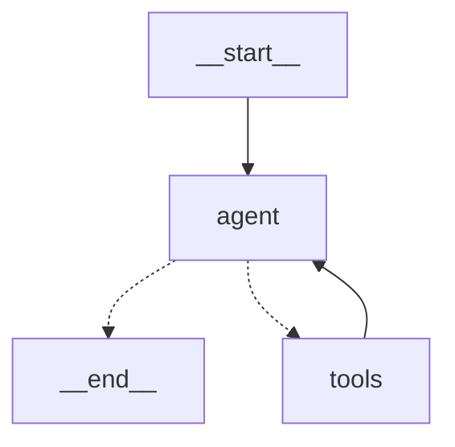

# AI Agent 学习笔记

## Day 1 (2026-01-31)

### 目标

快速验证一个最简 LangGraph 对话 demo，建立"代理 = LLM + 状态 + 图结构"的直观感受

### 环境搭建

- Miniconda + Python 3.12.3 (ARM64)
- 创建独立环境 py312 并设为默认激活

```bash
# 1. 创建环境
conda create -n py312 python=3.12 -y

# 2. 禁止 base 自动激活
conda config --set auto_activate_base false

# 3. 写入 .zprofile 自动激活 py312
echo -e "\n# Conda default environment\nconda activate py312" >> ~/.zprofile
source ~/.zprofile

# 4. 验证
python --version

# 5.安装依赖
python -m pip install -U langgraph langchain langchain-core langchain-openai langchain-community python-dotenv httpx
```

- 环境优化：切换到 `libmamba` 求解器，将默认 Python 改为 3.12，引入`conda-forge`

```shell
conda update -n base conda -y
conda install -n base conda-libmamba-solver -y
conda config --set solver libmamba
conda config --add channels conda-forge
conda config --set channel_priority strict
```

- LLM 选择：qwen-flash,理由，速度快，免费

### 代码实现

- 文件：`hello_agent.py`
- 关键代码片段：

```python
#构建prompt
def create_prompt() -> ChatPromptTemplate:
    return ChatPromptTemplate.from_messages([
        ("system", SYSTEM_PROMPT),
        MessagesPlaceholder("messages"),
    ])

#构建带prompt的llm实体
llm = ChatOpenAI(
    base_url=config.base_url,
    api_key=config.api_key,
    model=config.model,
    temperature=config.temperature,
)
prompt = create_prompt()
llm_chain = prompt | llm

#构建代理节点
def agent(state: MessagesState) -> dict:
    """核心代理节点"""
    try:
        response = llm_chain.invoke(state["messages"])
        logger.debug(f"生成回复，长度：{len(response.content)}")
        return {"messages": [response]}
    except Exception as e:
        logger.error(f"代理执行失败: {str(e)}")
        error_msg = AIMessage(content=f"抱歉，发生内部错误：{str(e)}\n请稍后再试。")
        return {"messages": [error_msg]}

#构建图      
def build_graph():
    workflow = StateGraph(state_schema=MessagesState)
    workflow.add_node("agent", agent)
    workflow.add_edge(START, "agent")
    workflow.add_edge("agent", END)
    return workflow.compile()
graph = build_graph()

# 循环调用代理，并加入上下文
result = graph.invoke({"messages": messages_history})
ai_msg = result["messages"][-1]
messages_history.append(ai_msg)
```

### 运行输出

```bash
❯ python hello_agent_v1.py
2026-01-31 16:42:03 | INFO  | 加载模型配置：openrouter / deepseek/deepseek-chat (temp=0.4)
2026-01-31 16:42:03 | INFO  | LangGraph 已编译完成

══════════════════════════════════════════════════════════════════════
🤖 AI 代理对话模式 已启动
  模型：deepseek/deepseek-chat
  温度：0.4
  最大历史：20 条
  命令：/help 查看帮助   exit / quit / q 退出
══════════════════════════════════════════════════════════════════════

你: 你好啊
2026-01-31 16:42:19 | INFO  | HTTP Request: POST https://openrouter.ai/api/v1/chat/completions "HTTP/1.1 200 OK"
AI : <thinking>
1. 理解用户意图：用户在进行简单的问候
2. 需要的信息/工具：无需额外信息
3. 我的推理步骤：作为AI助手，应该礼貌回应问候
</thinking>

<final_answer>
您好！我是AI助手，很高兴为您服务。请问有什么可以帮您的吗？
</final_answer>

你: 
```

### 问题 & 解决

- **ModuleNotFoundError: No module named 'langgraph'**
  - 原因：pip 装到了错的环境
  - 解决：`conda activate py312 + python -m pip install ...`
- **多轮对话失忆**
  - 原因：每次invoke只传当前消息
  - 解决：外部维护`messages_history`列表，完整传入

### 关键概念总结

1. **ChatPromptTemplate + MessagesPlaceholder**

   用来构建带历史消息的结构化提示模板，是控制输出格式的关键

2. **ChatOpenAI + LCEL 链式调用（prompt | llm）**

   LangChain 的现代写法，简洁且可组合。

3. **MessagesState**

   LangGraph 内置的状态类型，自动处理 messages 追加，比自定义 TypedDict 更简洁。

4. **agent 节点**

   代理的核心逻辑：接收 state → 调用 LLM → 返回更新后的 state。

5. **StateGraph & compile**

   定义图结构（节点 + 边），compile 后得到可调用的 graph 对象。

6. **上下文记忆的真相**

   LangGraph invoke是无状态的，必须自己每次传入完整消息历史。

### 心得 & 最大收获

- 第一次感受到"写 AI 代理"和"写普通函数"很像（节点 = 函数，状态 = 参数）
- 明白了为什么很多人说 LangGraph 比老 LangChain AgentExecutor 更灵活（但也更需要手动管理状态）
- 环境配置虽然花了时间，但一旦通了，后续开发效率很高
- 最大的惊喜：跑通多轮对话后，真的有"它在和我聊天"的感觉

## Day 2 (2026-02-01/02)

### 今日目标

让代理具备工具调用能力，实现最基础的 ReAct 循环（Reason → Act → Observe → Reason → Final Answer）

### 核心实现

1. **工具定义**

```python
@tool
def calculate(expression: str) -> str:
    """执行数学计算。注意：sin/cos/tan 默认使用弧度。如需角度计算，请使用 pi 配合。"""
    try:
        allowed_names = {"__builtins__": {}}
        allowed_names.update({
            "sin": __import__("math").sin,
            "cos": __import__("math").cos,
            "tan": __import__("math").tan,
            "sqrt": __import__("math").sqrt,
            "pi": __import__("math").pi,
        })
        result = eval(expression, allowed_names)
        return str(result)
    except Exception as e:
        return f"计算错误：{str(e)}"
```

1. **工具绑定与链（关键顺序）**

```python
tools = [calculate]
llm_with_tools = llm.bind_tools(tools)           # 先绑定工具
prompt = create_prompt()
llm_chain = prompt | llm_with_tools              # 再接提示词
```

1. **系统提示词（关键部分）**

```
你是一个具备计算能力的 AI 助手。
当用户要求进行数学运算时，请调用 calculate 工具。
计算完成后，请根据工具返回的结果给用户最终答案。
全程用中文回复。
```

1. **ReAct 图结构**

```python
def build_graph_with_tool():
    workflow = StateGraph(state_schema=MessagesState)
    tool_node = ToolNode(tools=tools)
    workflow.add_node("agent", agent)
    workflow.add_node("tools", tool_node)
    workflow.add_edge(START, "agent")
    workflow.add_conditional_edges(
        "agent",
        tools_condition,
        {"tools": "tools", END: END}
    )
    workflow.add_edge("tools", "agent")
    return workflow.compile()
```

1. **可视化（Mermaid 图）**



1. **交互循环关键逻辑（摘录）**

```python
messages_history.append(user_msg)
if len(messages_history) > config.max_history:
    messages_history = messages_history[-config.max_history:]
result = graph.invoke({"messages": messages_history})
ai_msg = result["messages"][-1]
messages_history.append(ai_msg)
```

### 测试记录（真实输出）

1. 输入：你好
   输出：正常问候回复（无工具调用）

2. 输入：8 * 9 是多少？
   输出：8 × 9 等于 72

3. 输入：sin(pi/2) 等于多少？
   输出：sin(π/2) 等于 1.0

4. 输入：刚才的计算结果是多少？
   输出：刚才的计算结果是：sin(π/2) = 1.0。

5. 输入：(3 + 5) * 2 是多少？
   输出：(3 + 5) × 2 等于 16

### 关键收获（5 条）

1. 工具绑定必须先 llm.bind_tools，再 prompt | llm_with_tools（顺序反了会报错）
2. tools_condition 自动判断 AIMessage 是否有 tool_calls，决定是否进入 tools 节点
3. ToolNode 会自动执行工具并把结果包装成 ToolMessage 回传给 agent
4. prompt 必须明确写明工具使用规则、调用格式，否则模型可能不触发工具
5. qwen-flash 模型工具调用能力较强，适合当前实验（比 deepseek-chat 更稳定）

### 心得 & 感受

- 今天最爽的时刻：更换更快更准确调用参数的模型后，准确率大幅上升；画出 Mermaid 图后，能够更深刻理解 ReAct 循环的流转路径
- 最大的困惑：无（今天整体很顺）
- 对代理的新理解：代理本质就是一个大模型节点，输入输出其实是自定义的，目前还是单输入单输出，记忆其实是代码实现的（messages_history 列表），后续可能会有更好的实现方式，或者封装好的函数（如 checkpointer）

### 下一步计划（Day 3+）

- 加更多工具（当前时间、天气查询、网页搜索）
- 尝试更强模型（qwen2.5-72b-instruct）
- 引入 checkpointer / MemorySaver，实现会话持久化与断点续传
- 测试复杂多步计算（例如需要多次调用工具的题目）
- （可选）用 LangGraph Studio 可视化调试

## Day 3 (2026-02-03)

### 今日目标

实现会话持久化（checkpointer） + 增加实用工具（时间 + 天气）

### 核心实现

1. **持久化机制（MemorySaver）**
   - 关键代码：

     ```python
     from langgraph.checkpoint.memory import MemorySaver
     memory = MemorySaver()
     graph = build_graph_with_tool().compile(checkpointer=memory)
     ```

   - 交互时固定 thread_id：

     ```python
     checkpoint_config = {"configurable": {"thread_id": "my_test_session_1"}}
     result = graph.invoke({"messages": [HumanMessage(content=user_input)]}, config=checkpoint_config)
     ```

   - 特点：内存型，重启程序后丢失；适合开发调试

2. **新增工具**
   - **get_current_time**（无外部依赖）

     ```python
     @tool
     def get_current_time(format_str: str = "%Y-%m-%d %H:%M:%S") -> str:
         """获取当前时间，格式化输出"""
         return datetime.now().strftime(format_str)
     ```

   - **get_weather**（免费 open-meteo API）

     ```python
     @tool
     def get_weather(city: str = "成都") -> str:
         """获取指定城市天气，默认成都"""
         try:
             city_coords = {
                 "成都": {"lat": 30.57, "lon": 104.06},
                 # 其他城市...
             }
             coords = city_coords.get(city, city_coords["成都"])
             url = f"https://api.open-meteo.com/v1/forecast?latitude={coords['lat']}&longitude={coords['lon']}&current=temperature_2m,weathercode&timezone=Asia/Shanghai"
             resp = requests.get(url, timeout=5).json()
             temp = resp["current"]["temperature_2m"]
             weather_code = resp["current"]["weathercode"]
             weather_map = {0: "晴朗", 1: "多云", ...}
             weather_desc = weather_map.get(weather_code, "未知天气")
             return f"{city}当前天气：{weather_desc}，温度约 {temp}℃"
         except Exception as e:
             return f"天气查询失败：{str(e)}"
     ```

3. **工具集合 & 绑定**

   ```python
   tools = [calculate, get_current_time, get_weather]
   llm_with_tools = llm.bind_tools(tools)
   llm_chain = prompt | llm_with_tools
   ```

4. **交互循环关键变化**
   - 不再手动维护 messages_history
   - 每次只传当前新消息，checkpointer 自动加载历史
   - 支持 /clear 命令删除 checkpoint

5. **Mermaid 图（当前结构）**

   ```mermaid
   graph TD
       __start__ --> agent
       agent -.-> __end__
       agent -.-> tools
       tools --> agent
   ```

### 测试记录

1. 输入：你好  
   输出：正常问候回复（无工具调用）

2. 输入：现在几点了？  
   输出：调用 get_current_time，返回当前时间

3. 输入：成都天气怎么样？  
   输出：调用 get_weather，返回成都温度 + 天气描述

4. 输入：刚才的时间是几点？  
   输出：能记住上一次时间（持久化生效）

5. 重启程序后问：刚才我说过什么？  
   输出：不记得（MemorySaver 是内存型，重启进程丢失）

### 关键收获

1. MemorySaver 实现"同一个进程内"持久化，但重启程序后丢失
2. checkpointer 的核心是 thread_id：同一个 id = 同一个会话
3. invoke 时只传新消息 + config，checkpointer 自动加载历史
4. 工具调用成功率高时，prompt 必须写清楚"什么时候用哪个工具"
5. qwen-flash 在工具调用 + 中文回复上表现稳定

### 心得

最爽的时刻：第一次看到代理自动调用时间和天气工具，并且能记住上文  
最大的困惑：一开始以为 MemorySaver 能跨程序持久化，后来才明白它是内存型  
对代理的新理解：代理的"记忆"其实是外部状态管理（checkpointer），模型本身无状态；持久化是 agent 系统工程化的第一步

### 下一步计划

- 换成 SqliteSaver，实现"重启程序甚至重启电脑还能接着聊"
- 加网页搜索工具（requests + beautifulsoup 或 serpapi）
- 测试多步任务（例如"先查天气，再算温度*2"）
- 用 LangGraph Studio 打开当前图，实时调试
- 尝试更强模型（qwen2.5-72b-instruct）对比工具调用稳定性

## Day 4 (2026-02-05)

### 今日目标

实现真正的持久化存储（SqliteSaver）+ 项目结构优化

### 核心实现

1. **SQLite 持久化机制**
   - 数据库文件路径管理：

     ```python
     # 将 SQLite 文件放到独立目录（如 ./data/checkpoints/checkpoints.db）
     db_dir = Path(__file__).parent / "data" / "checkpoints"
     db_dir.mkdir(parents=True, exist_ok=True)
     db_path = db_dir / "checkpoints.db"
     ```

   - SQLite 上下文管理器使用：

     ```python
     with SqliteSaver.from_conn_string(str(db_path)) as memory:
         compile_graph = graph.compile(checkpointer=memory)
         # 聊天循环...
     ```

   - 关键改进：数据库文件放到 `./data/checkpoints/checkpoints.db`，保持根目录整洁

2. **会话清空功能**
   - 支持 `/clear` 或 `/reset` 命令：

     ```python
     if cmd in ['/clear', '/reset']:
         thread_id = checkpoint_config["configurable"]["thread_id"]
         memory.delete_thread(thread_id)
         print(f"🧹 当前会话历史已清空，thread_id: {thread_id}")
         continue
     ```

3. **项目结构优化**
   - 保持现有的工具集合不变：

     ```python
     tools = [calculate, get_current_time, get_weather]
     llm_with_tools = llm.bind_tools(tools)
     llm_chain = prompt | llm_with_tools
     ```

   - 图构建逻辑保持一致：

     ```python
     def build_graph_with_tool() -> StateGraph:
         """构建带有工具调用能力的 LangGraph 图"""
         workflow = StateGraph(state_schema=MessagesState)
         tool_node = ToolNode(tools=tools)
         workflow.add_node("agent", agent)
         workflow.add_node("tools", tool_node)
         workflow.add_edge(START, "agent")
         workflow.add_conditional_edges(
             "agent",
             tools_condition,
             {"tools": "tools", END: END}
         )
         workflow.add_edge("tools", "agent")
         return workflow
     ```

4. **启动信息优化**
   - 显示持久化支持状态：

     ```python
     print("🤖 AI 代理对话模式 已启动（支持持久化）")
     print(f"  模型：{config.model}")
     print(f"  温度：{config.temperature}")
     print("  命令：/help 查看帮助   exit / quit / q 退出")
     ```

5. **Mermaid 图（当前结构）**

   ```mermaid
   graph TD
       __start__ --> agent
       agent -.-> __end__
       agent -.-> tools
       tools --> agent
   ```

### 测试记录

1. 输入：你好  
   输出：正常问候回复（显示支持持久化）

2. 输入：现在几点了？  
   输出：调用 get_current_time，返回当前时间

3. 输入：成都天气怎么样？  
   输出：调用 get_weather，返回成都温度 + 天气描述

4. 输入：刚才的时间是几点？  
   输出：能记住上一次时间（持久化生效）

5. 输入：/clear  
   输出：?? 当前会话历史已清空，thread_id: my_test_session_1

6. 重启程序后问：刚才我说过什么？  
   输出：能记住重启前的对话内容（SQLite 持久化生效）

7. 检查数据库文件：./data/checkpoints/checkpoints.db  
   结果：数据库文件存在，数据完整保存

### 关键收获

1. SqliteSaver 实现真正的跨程序持久化，重启后数据不丢失
2. 数据库文件放到 data/checkpoints 目录是良好的工程实践
3. 使用上下文管理器确保 SQLite 连接正确关闭
4. `memory.delete_thread(thread_id)` 可以清空指定会话
5. 持久化存储让代理系统更加稳定可靠

### 心得

最爽的时刻：重启程序后代理还能记住之前的对话内容，真正的持久化实现了  
最大的困惑：SqliteSaver 的上下文管理器使用方式，最初踩了坑（TypeError: Invalid checkpointer）  
对代理的新理解：持久化是代理系统从实验走向实用的重要一步，让用户体验更连贯

### 下一步计划

- 添加会话管理功能（多会话支持、会话列表、会话切换）
- 实现会话数据备份和恢复功能
- 加网页搜索工具（requests + beautifulsoup）
- 测试复杂多步任务（如"查完天气后计算温度变化"）
- 用 LangGraph Studio 可视化调试状态
- 尝试更强模型（qwen2.5-72b-instruct）对比效果
- 考虑添加用户认证和权限管理
